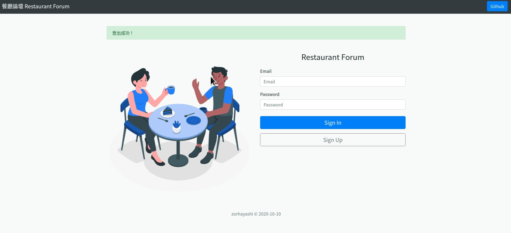
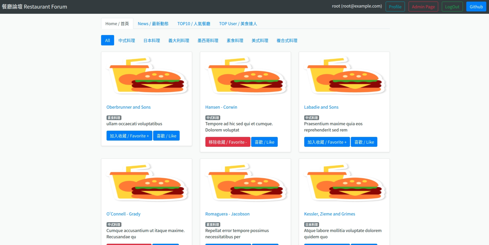

# 餐廳論壇 Restaurant Forum

### Node.js + Express 

## Quick Look



##  Features
 - Sign up / Log in	/ Log out	
 - Quick view all restaurants	/ View detail of restaurant	
 - favorite / like / comments / edit
 - CRUD / Migration Mysql


## Description
* * *

##   Accout

email | password
------------- | -------------
root@example.com  | 1234
user@example.com  | 1234


## Requirements 

-   nvm >= v1.1.7
-   node >=v10.15.0
-   npm >= v6.4.1
-   nodemon >= v2.0.4
-   mysql 

## Installation App

**1. Enter the project folder**
```
$ git clone https://github.com/YunYuLo/restaurant_forum.git & cd restaurant_forum
```

**2. Install packages via npm**
```
$ npm install
```

**3. Create .env file**
```
$ touch .env
```

**4. Store API Key in .env file and save**
```
IMGUR_CLIENT_ID= <YOUR_imgur_ID>
JWT_SECRET= <YOUR_JWT_key>
```

**5. Edit databace config in config.json file**
```
$ vim /config/config.json

...

"development": {
  "username": "root",
  "password": "<YOUR_WORKBENCH_PASSWORD>",
  "database": "forum",
  "host": "127.0.0.1",
  "dialect": "mysql"
}
```

**6. Run mock data migration & seeder**
> run the following code in the console
```
$ npx sequelize db:migrate
$ npx sequelize db:seed:all
```

**7. Activate the server**
```
$ npm run dev
```

**8. Find the message for successful activation**
```
> Example app listening on port 3000!
```
You may visit the application on browser with the URL: 

http://localhost:3000


## Authors

 - [zorhayashi](https://github.com/zorhayashi)

